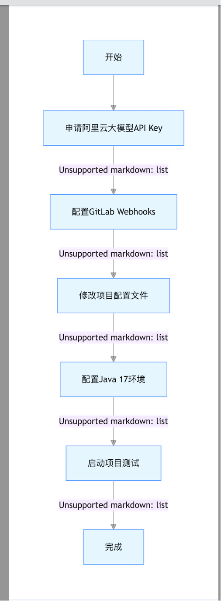
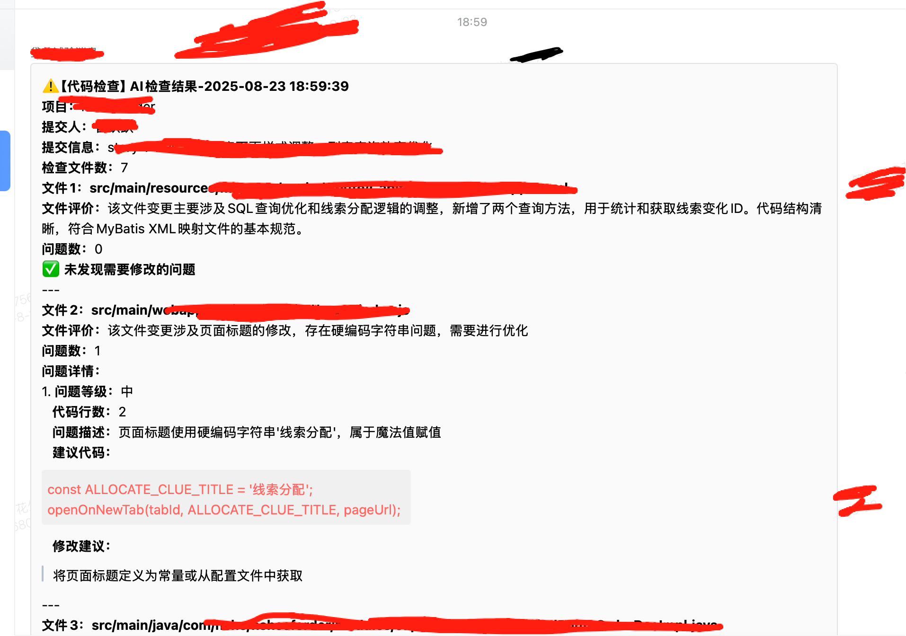

# 代码 AI 检测与企业微信通知工具（简易版）

## 项目介绍

本项目是一个基于 Java 开发的简易工具，主要功能为通过 AI 对代码进行检测分析，并将检测结果自动推送至企业微信，帮助团队快速获取代码质量反馈。支持通过配置与 GitLab 集成，可响应代码相关事件触发检测流程。

## 功能说明

1.  代码检测：基于配置的 AI 模型对单次提交各个文件中的删减代码进行检测（如代码规范、潜在问题等）

2.  通知推送：将检测结果实时发送至企业微信指定机器人

3.  GitLab 集成：通过 GitLab WebHook 触发代码检测流程

4. 可在CodeProcessingService.generateFilePrompt加入单独规则。（如特别检查不能出现魔法值赋值）

## 核心模块介绍

### 1. 配置信息模块

项目核心配置通过 `application.properties` 文件管理，关键配置及说明如下：

| 配置项                                                       | 中文备注                                    |
| --------------------------------------------------------- |-----------------------------------------|
| `server.port=8010`                                        | 应用服务的 WEB 访问端口                          |
| `spring.ai.dashscope.api-key=xxx`                         | 阿里云 DashScope AI 服务的 API 密钥             |
| `spring.ai.dashscope.chat.options.model=qwen3-coder-plus` | 用于代码检测的 AI 模型（此处为通义千问代码模型）              |
| `spring.ai.dashscope.chat.options.temperature=0.3`        | AI 生成结果的随机性参数（值越低越稳定）                   |
| `spring.ai.dashscope.chat.options.topP=0.3`               | AI 生成结果的多样性参数（值越低结果越集中）                 |
| `spring.ai.dashscope.read-timeout=30000`                  | AI 服务请求的读取超时时间（单位：毫秒）                   |
| `gitlab.base-url=http://xxx`                              | GitLab 服务的基础访问地址                        |
| `gitlab.private-token=xxx`                                | 访问 GitLab 的私有令牌（用于 API 调用权限）            |
| `gitlab.webhook.secret=xxx`                               | GitLab WebHook 的签名密钥（用途保持与 GitLab 配置一致） |
| `gitlab.webhook.endpoint=/gitlab/webhook`                 | 接收 GitLab WebHook 请求的接口路径               |
| `wechat.webhook-url=xxx`                                  | 企业微信机器人的 WebHook 地址（用于发送通知）             |
| `app.code-inspect.enabled=true`                           | 是否启用代码检测功能（true 为启用）                    |
| `app.code-inspect.ignore-file-types=xxx`                  | 代码检测时忽略的文件类型（如.md、.txt 等）               |
| `app.code-inspect.max-code-lines=1000`                    | 单次单个文件检测的最大代码行数限制                       |
| `app.code-inspect.timeout-seconds=60`                     | 代码检测的超时时间（单位：秒）                         |
| `logging.level.root=INFO`                                 | 根日志级别（INFO 为基本信息输出）                     |
| `logging.level.com.company.gitlab=DEBUG`                  | 项目内 GitLab 相关模块的日志级别（DEBUG 为详细输出）       |
| `logging.level.org.gitlab4j=WARN`                         | GitLab4j 工具包的日志级别（WARN 为仅输出警告及以上信息）     |

### 2. 配置流程模块

#### 步骤 1：环境准备

*   安装 JDK 17 及以上版本

*   确保网络可访问配置中的 GitLab 地址、AI 服务地址（DashScope）及企业微信 API 地址

#### 步骤 2：配置文件修改

1.  复制项目中的 `application.properties` 模板（若有）或直接修改现有文件

2.  填写必填配置项：

*   替换 `spring.ai``.dashscope.api-key` 为有效的 DashScope API 密钥

*   配置 `gitlab.base-url` 和 `gitlab.private-token` 以连接目标 GitLab

*   替换 `wechat.webhook-url` 为实际的企业微信机器人 WebHook（需在企业微信中创建机器人获取）

1.  可选配置调整：

*   根据需求修改 `app.code-inspect.ignore-file-types` 调整忽略文件类型

*   调整 `spring.ai``.dashscope.chat.options.temperature` 等参数优化 AI 检测效果

#### 步骤 3：启动项目

*   通过 Maven 构建项目：`mvn clean package -DSkipTests`

*   运行 jar 包：`java -jar 项目打包后的jar文件名.jar`

*   验证启动：访问 `http://localhost:8010` 确认服务启动成功(可在日志看到git版本信息)

### 3. 代码检测模块

*   功能：负责获取待检测代码（如从 GitLab 拉取指定文件 / 分支）、调用 AI 服务进行检测、处理检测结果

*   核心逻辑：根据配置的检测范围（排除忽略文件类型），当触发检测事件（如 GitLab 提交事件）时，提取代码内容并调用 AI 模型分析，生成检测报告

### 4. 通知模块

*   功能：将代码检测模块生成的报告转换为企业微信支持的格式（如文本、Markdown），通过企业微信 WebHook 发送

### 5. WebHook 处理模块

*   功能：接收 GitLab 发送的 WebHook 请求（如代码提交、合并请求事件），触发代码检测流程

*   安全机制：通过 `gitlab.webhook.secret` 验证请求合法性（具体验证逻辑需结合代码实现）

## 注意事项

1.  敏感配置（如 API 密钥、私有令牌）请勿提交至代码仓库，建议使用环境变量或配置中心管理

2.  若 AI 检测超时，可适当调整 `app.code-inspect.timeout-seconds` 和 `spring.ai``.dashscope.read-timeout`

## 快速开始

### 流程说明：

1.  **申请 API Key**：获取调用阿里云大模型的凭证，是 AI 代码检测功能的基础

2.  **配置 GitLab Webhooks**：建立代码提交与检测系统的联动，实现自动触发检测

3.  **修改配置文件**：将 API Key、GitLab 信息等关键参数录入系统配置

4.  **配置 Java 环境**：搭建项目运行的基础环境（项目依赖 Java 17）

5.  **启动测试**：验证全流程是否通畅，包括代码提交→检测触发→结果通知的完整链路

## 可能的扩展方向

*   支持更多代码检测维度（如性能问题、安全漏洞）

*   优化企业通知方式（如引入叮叮机器人通知）

*   增加手动触发检测的接口

*   集成更多代码仓库（如 GitHub、Gitee）

## 检测结果通知示例

